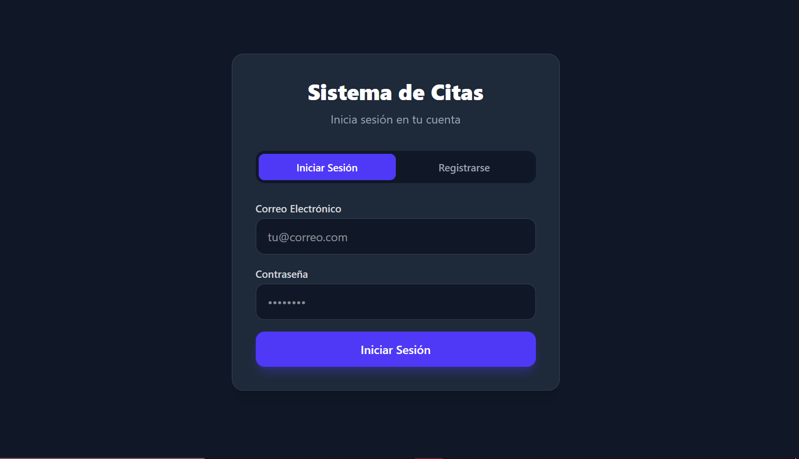
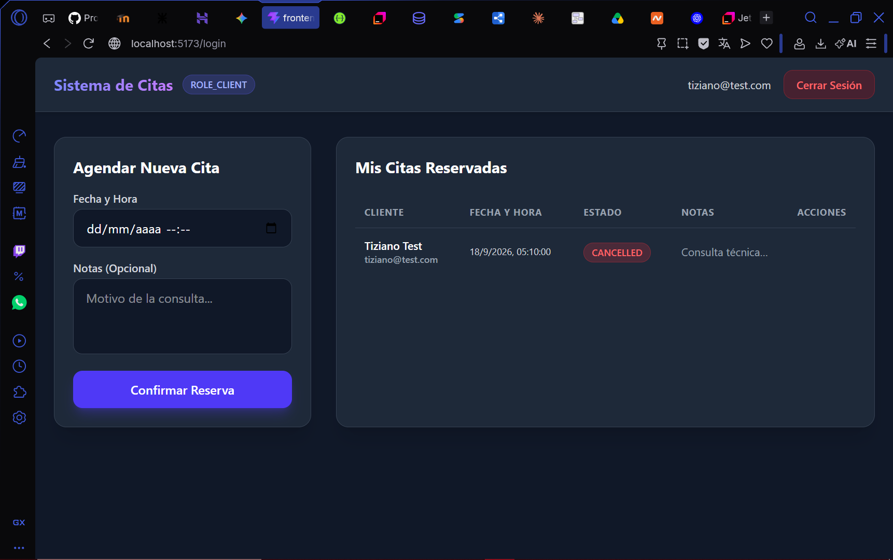
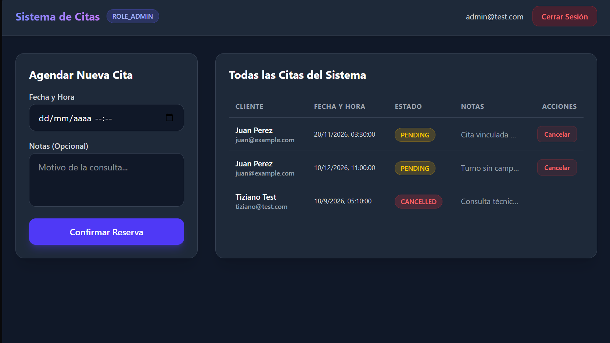

# Sistema de Reservas y Citas (Full-Stack) 🩺📅🚀

<p align="center">
  
  
  
  
  
  
  
  
  
  
</p>

---

## 📋 Descripción General del Proyecto

**Sistema de Reservas y Citas** es una aplicación **Full-Stack** moderna, robusta y lista para producción diseñada como proyecto de portafolio profesional. El sistema permite gestionar la programación de turnos médicos o profesionales con prevención de solapamientos en tiempo real, persistencia relacional en contenedores Docker y una interfaz de usuario limpia e interactiva.

---

## 🏗️ Arquitectura Full-Stack

### 🧠 Backend (Spring Boot & PostgreSQL)
- **Arquitectura por Capas**: Estricta separación de responsabilidades (`Controller`, `Service`, `Repository`, `DTO`, `Model`, `Exception`).
- **Seguridad Stateless (JWT & Spring Security 6)**: Autenticación basada en JSON Web Tokens firmados criptográficamente con HMAC-SHA256 (JJWT 0.12.5). Desacoplamiento de beans en `ApplicationSecurityConfig` para evitar dependencias circulares.
- **Persistencia Relacional (JPA / Hibernate)**: Mapeo de entidades con relaciones `@ManyToOne` (Lazy Loading) y base de datos relacional robusta en **PostgreSQL 16**.
- **Gestión de Errores Global**: Manejo centralizado mediante `@RestControllerAdvice` con códigos HTTP semánticos (`400`, `401`, `403`, `404`, `409`).

### 🎨 Frontend (React, Vite & Tailwind CSS v4)
- **SPA Moderna**: Desarrollada con React y empaquetada con Vite para un rendimiento ultrarrápido.
- **Cliente HTTP Axios & Interceptores**: Inyección automática del Bearer Token en cada petición HTTP y manejo centralizado de respuestas no autorizadas (`401`).
- **Contexto Global de Sesión (`AuthContext`)**: Gestión centralizada del estado de autenticación y roles de usuario, evitando el *Prop Drilling*.
- **Estilizado Atractivo**: Interfaces responsivas diseñadas con **Tailwind CSS v4**.

---

## 👥 Matriz de Roles y Accesos (RBAC)

| Rol | Permisos y Endpoints Asociados |
| :--- | :--- |
| **`ROLE_CLIENT`** | • Registro e inicio de sesión (`/api/auth/**`).<br>• Agendamiento de citas propias con validación de fechas futuras y solapamientos.<br>• Consulta de historial exclusivo de citas (`/api/appointments/my-appointments`). |
| **`ROLE_ADMIN`** | • Todos los permisos de cliente.<br>• Consulta global de todas las citas del sistema (`/api/appointments`).<br>• Cancelación lógica (*Soft Delete*) de cualquier turno con respuesta `204 No Content`. |

---

## 🖼️ Capturas de Pantalla (UI Preview)

### 1. Pantalla de Autenticación (Login / Registro)


### 2. Dashboard del Cliente (Agendamiento y Mis Citas)


### 3. Panel de Administración (Gestión Global de Turnos)


---

## 🚀 Guía de Ejecución Local Completa

### Paso 1: Levantar la Infraestructura de Base de Datos (Docker)
Asegúrate de tener Docker instalado y ejecuta en la raíz del proyecto:
```bash
docker compose up -d
```
*(Esto levantará un contenedor PostgreSQL 16 en el puerto `5432` con volumen persistente).*

### Paso 2: Ejecutar el Backend (Spring Boot)
Compila y ejecuta el servidor backend en el puerto `8080`:
```bash
mvn clean install
mvn spring-boot:run
```
*Documentación interactiva Swagger UI disponible en:* [http://localhost:8080/swagger-ui/index.html](http://localhost:8080/swagger-ui/index.html)

### Paso 3: Ejecutar el Frontend (React + Vite)
Navega al directorio `frontend`, instala dependencias y arranca el servidor de desarrollo en el puerto `5173`:
```bash
cd frontend
npm install
npm run dev
```
*Accede a la aplicación en el navegador:* [http://localhost:5173](http://localhost:5173)

---

## 📖 Referencia Rápida de Endpoints (API)

| Método | Endpoint | Descripción | Rol |
| :--- | :--- | :--- | :--- |
| **POST** | `/api/auth/register` | Registro de usuarios. | Público |
| **POST** | `/api/auth/login` | Inicio de sesión y entrega de JWT. | Público |
| **POST** | `/api/appointments` | Agendamiento de turnos. | Autenticado |
| **GET** | `/api/appointments/my-appointments` | Consulta de citas personales. | `ROLE_CLIENT` |
| **GET** | `/api/appointments` | Consulta de todas las citas. | `ROLE_ADMIN` |
| **DELETE** | `/api/appointments/{id}` | Cancelación lógica (*Soft Delete*). | `ROLE_ADMIN` |
